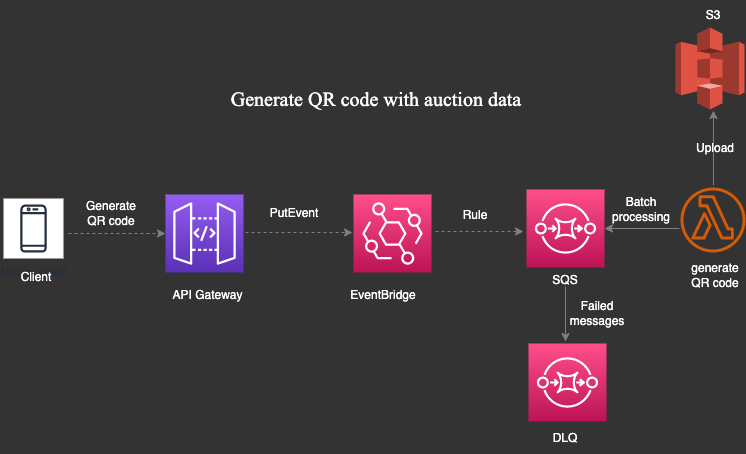

**Auction Serverless & Microservices REST API**

 

## 👉Architecture of the Auction API

The use case for this implementation is uploading a listing agreement, which is a document with heavy payload that outlines the terms and conditions of a real estate transaction. 

## 👉Architecture of Message Queue

Decoupled sending emails to users improving fault tolerance.  

## 👉Architecture of Streaming Order Receipts

Improved customer experiences using lambda streaming technique.  

## 👉Architecture of Generating QR code for auction details

Decoupled application qr code generation, with event driven architecture reducing latency, and improving scalability using Chreography pattern. 

## 👉Architecture of Managed Store Checkout flow using step functions

A Managed Store Checkout flow using AWS Step Functions is a system designed to manage the checkout process for an auction payment using orchestrator pattern.  

## 👉Architecture of implementing WAF and Cloudfront on Auction service functions

When implementing an auction service, it is important to ensure that the service is secure and highly available. One way to achieve this is by using AWS WAF (Web Application Firewall) and Amazon CloudFront together.  

<!-- 👉Architecture of implementing Upload Listing Agreement  -->

## 👉Architecture of implementing Upload Listing Agreement

The use case for this implementation is uploading a listing agreement, which is a document with heavy payload that outlines the terms and conditions of a real estate transaction. 

## 👉Architecture of implementing Notes Service for Sellers

Note-taking system for sellers in the admin panel

