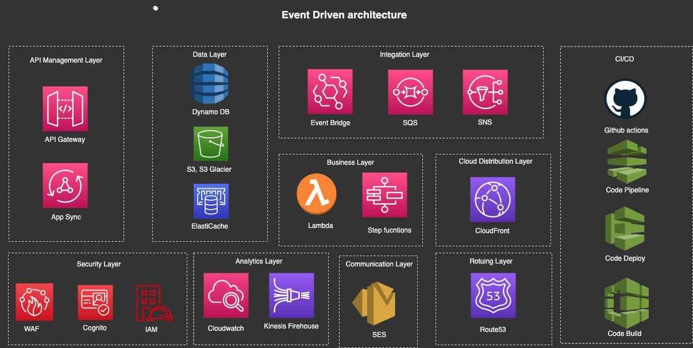
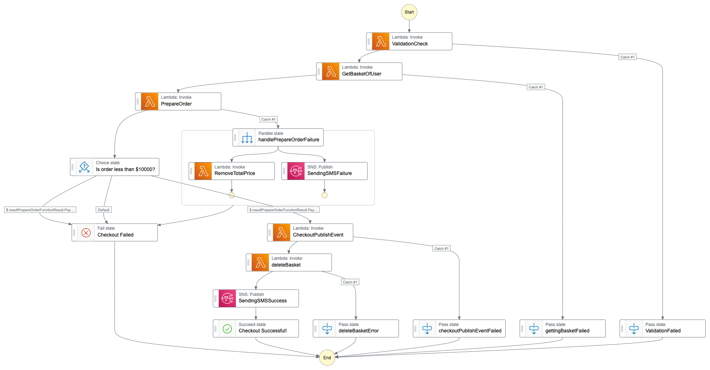
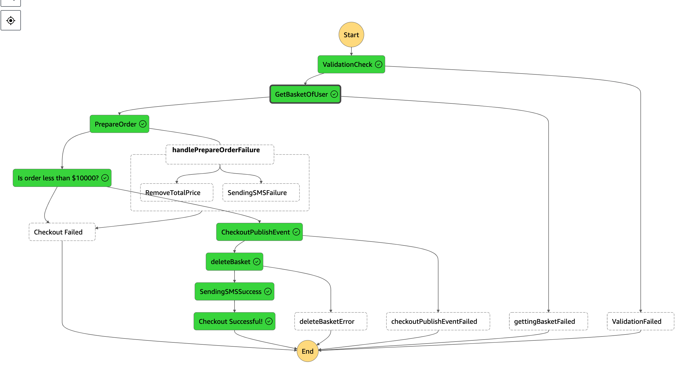

# ECOMAUCTION API

The ECOMAUCTION is an API that enables users to buy and sell products through an online auction system. It allows users to create auctions for their products, set starting prices, and receive bids from potential buyers. The API provides endpoints for users to manage their auctions, including creating, updating, and deleting auctions, as well as placing bids on existing auctions. With this API, users can easily buy and sell products online through an auction-style marketplace. 

1. Serverless Infrastructure development  
   IaC with serverless framework and AWS cdk using typescript. 

2. Microservices Lambda function development  
   Nodejs Lambda functions using aws sdk with javascript v3. 

**Architecture of EcomAuction serverless microservices**

_Synchronous communication with API Gateway. Amazon eventbridge as event bus and SQS as custom queue service using asynchronous communications. Event source mapping to process messages in another service as messages appear in the queue.
Using Queue Chaining, Publish-Subscribe, Fan-out design patterns
._

| Pattern              | Service              |
| -------------------- | -------------------- |
| Topic-Queue Chaining | SQS                  |
| Load balancing       | SQS                  |
| Event Bus            | Event Bridge         |
| Pub/sub (fan-out)    | SNS                  |
| Orchestration        | Step Functions       |
| API (REST/Graphql)   | AppSync/ API Gateway |
| Event Streams        | Kinesis              |
| Chreography          | Event Bridge         |
| Saga Pattern         | Step functions       |
| Circuit Breaker      | Dynamo DB, Lambda    |

The following are all the usecases covered in the api.

 

## 👉Architecture of the Auction API

Implemented a comprehensive auction service that enables Create, Read, Update, and Delete (CRUD) operations on auctions and middy middleware for input validation. Additionally, leveraged AWS EventBridge schedulers to process expired auctions and automatically trigger notifications to the notifications service. This approach ensures that expired auctions are handled efficiently and that notifications are sent to sellers and buyers in a timely manner. The system was designed with scalability and fault tolerance in mind, ensuring that it can handle large volumes of auctions and events without compromising performance or reliability.

## 👉Architecture of Message Queue

Decoupled sending emails and other notifications to users improves fault tolerance. By having a notification service that handles all notifications separately, we can ensure that the process of sending notifications doesn't affect the rest of the application. This separation of concerns also allows for better scalability and maintainability of the system, as each service can be developed, tested, and deployed independently.

## 👉Architecture of Streaming Order Receipts

Used Lambda function urls and Lambda streaming technique to improve customer experiences by reducing application latency and providing partial results in real-time during long-running tasks or queries.  

## 👉Architecture of Generating QR code for auction details

Decoupled application qr code generation, with event driven architecture reducing latency, and improving scalability using Chreography pattern. 

## 👉Architecture of Managed Store Checkout flow using step functions

A Managed Store Checkout flow using AWS Step Functions is a system designed to manage the checkout process for an auction payment using orchestrator pattern.  

## 👉Architecture of implementing WAF and Cloudfront on Auction service functions

When implementing an auction service, it is important to ensure that the service is secure and highly available. One way to achieve this is by using AWS WAF (Web Application Firewall) and Amazon CloudFront together.  

<!-- 👉Architecture of implementing Upload Listing Agreement  -->

## 👉Architecture of implementing Upload Listing Agreement

The use case for this implementation is uploading a listing agreement, which is a document with heavy payload that outlines the terms and conditions of a real estate transaction. 

## 👉Architecture of implementing Notes Service for Sellers

Developed a note-taking system for sellers in the admin panel, with Cognito authentication for secure access control. The system was integrated with CI/CD using Github Actions, and tested extensively with Jest. Additionally, implemented federated identities for Facebook and Google with Cognito, providing a seamless sign-in experience for users.

## 👉Architecture of Decoupling with SQS to imrpove usability

Tight coupling between our resources and dependency on external API can cause bottleneck. To avoid delays I have introduced decoupling with queue and later send websocket event using APIGateway websockets to client. Edge cases messages that cannot be processed will be send to DLQ.

## 👉Architecture of Serverless Log Archive

Through cloudwatch we can retain log data indefinitely but with a cost. So we will expire data in cloudwatch and stream
that logs into s3 bucket. So in s3 bucket we have lifecycle policy to move data to low cost destination like Glacier. Other services can catalog the data and query it from s3.

## 👉Architecture of RealTime Reporting Error

Send logs to cloudwatch with context. Cloudwatch metric will have a filter pattern by looking
at the attrbiutes of that JSON payload. Trigger an alarm on specific type of error. Alarm will trigger an SNS topic.
SNS will have lambda subscription that will create a meaningful message and email to admin.

## 👉Architecture of Disaster Recovery(DR) Strategy

To avoid downtime and improve performance for a notes service, I have used multi-site active or active architecture with a global DynamoDB table, Route 53 latency routing policies, and an SSL/TLS certificate for the domain using cloudformation.

## 👉Architecture of api calls to External API

Utilized EventBridge's content-based filtering feature to facilitate seamless integration between our API and external APIs through an event-driven architecture and asynchronous communication. Additionally, configured a Dead Letter Queue (DLQ) to prevent the loss of events as event bridge loses events after 24 hrs.

## 👉Architecture of CI/CD

Utilized AWS CodePipeline to automate my deployment process, combining continuous integration and continuous deployment. The pipeline is initiated by GitHub webhooks whenever new commits are pushed to the connected GitHub repository. The pipeline then packages the new code and moves it to an approval stage after running continuous integration tests. An approver then reviews the changes within the approval stage and approves the deployment. After approval, the pipeline deploys the new code, thereby achieving continuous deployment.

## 👉Architecture of Books Service

Create an AWS AppSync GraphQL API with subscriptions and use AWS Lambda functions as resolvers, using the Serverless Framework to deploy and manage the resources. Specifically, I enabled real-time data updates through subscriptions and leverage the scalability and cost-effectiveness of AWS Lambda to handle the API's business logic.

## 👉 Architecture of Ecommerce API

An ecommerce API with 3 microservices for Product, Basket, and Order can be implemented using three different patterns: synchronous, asynchronous, and event sourcing.

The synchronous approach involves REST APIs where each microservice waits for a response before proceeding. The asynchronous approach uses message brokers to decouple the microservices and improve scalability.

Event sourcing to record all the events and transactions that occur in the system, polling from sqs to retrieve records and invoke functions.

## 👉 Architecture of Checkout Order

Utilized the CDK and Step Functions with saga pattern to seamlessly orchestrate the flow of checkout order using express workflow.

## 👉 Architecture of Check product quantity

Utilized the CDK and Step Functions with to loop through all products in database and remove products that are out of stock using step functions callback pattern and mapping products.

## 👉 Architecture of Increasing apis performance

I followed the best practices for Lambda and API Gateway integration to ensure optimal performance, scalability, and security in my application.

## 👉 Architecture of Authentication Cognito CDK

To implement authentication in a CDK services, I utilized Amazon Cognito. This allowed me to easily incorporate user sign-up, sign-in, and access control functionality into my app services.

## 👉 Architecture of Product Search with ElasticCache with Redis

