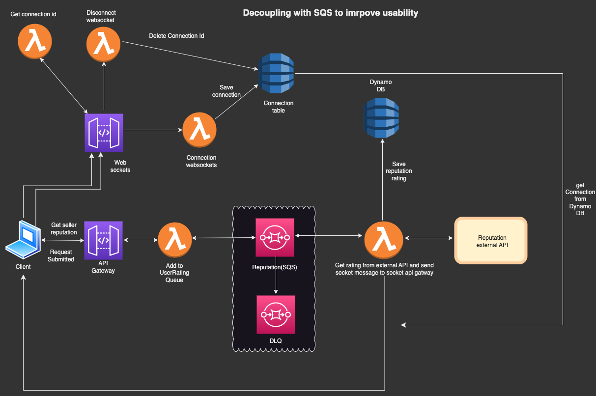

**Auction Serverless & Microservices REST API**

 

## 👉Architecture of the Auction API

The use case for this implementation is uploading a listing agreement, which is a document with heavy payload that outlines the terms and conditions of a real estate transaction. 

## 👉Architecture of Message Queue

Decoupled sending emails to users improving fault tolerance.  

## 👉Architecture of Streaming Order Receipts

Improved customer experiences using lambda streaming technique.  

## 👉Architecture of Generating QR code for auction details

Decoupled application qr code generation, with event driven architecture reducing latency, and improving scalability using Chreography pattern. 

## 👉Architecture of Managed Store Checkout flow using step functions

A Managed Store Checkout flow using AWS Step Functions is a system designed to manage the checkout process for an auction payment using orchestrator pattern.  

## 👉Architecture of implementing WAF and Cloudfront on Auction service functions

When implementing an auction service, it is important to ensure that the service is secure and highly available. One way to achieve this is by using AWS WAF (Web Application Firewall) and Amazon CloudFront together.  

<!-- 👉Architecture of implementing Upload Listing Agreement  -->

## 👉Architecture of implementing Upload Listing Agreement

The use case for this implementation is uploading a listing agreement, which is a document with heavy payload that outlines the terms and conditions of a real estate transaction. 

## 👉Architecture of implementing Notes Service for Sellers

Note-taking system for sellers in the admin panel using Cognito authentication, CI/CD with github actions and tested with jest

## 👉Architecture of Decoupling with SQS to imrpove usability

Tight coupling between our resources and dependency on external API can cause bottleneck. To avoid delays I have introduced decoupling with queue and later send socket event to client. Edge cases messages that cannot be processed will be send to DLQ.

## 👉Architecture of Serverless Log Archive

Through cloudwatch we can retain log data indefinitely but with a cost. So we will expire data in cloudwatch and stream
that logs into s3 bucket. So in s3 bucket we have lifecycle policy to move data to low cost destination like Glacier. Other services can catalog the data and query it from s3.

## 👉Architecture of RealTime Reporting Error

Send logs to cloudwatch with context. Cloudwatch metric will have a filter pattern by looking
at the attrbiutes of that JSON payload. Trigger an alarm on specific type of error. Alarm will trigger an SNS topic.
SNS will have lambda subscription that will create a meaningful message and email to admin.

## 👉Architecture of Disaster Recovery(DR) Strategy

To avoid downtime and improve performance for a notes service, I have used multi-site active or active architecture with a global DynamoDB table, Route 53 latency routing policies, and an SSL/TLS certificate for the domain using cloudformation.

## 👉Architecture of api calls to External API

Utilized EventBridge's content-based filtering feature to facilitate seamless integration between our API and external APIs through an event-driven architecture and asynchronous communication. Additionally, configured a Dead Letter Queue (DLQ) to prevent the loss of events as event bridge loses events after 24 hrs.
